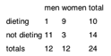

Frequency tests
================

* Example: Prop of dieting woman higher than for men?



```
?fisher.test
```


Proportion Tests
================


```r
prop.test(x=333, n=1022, conf.level=0.98)
```

```
## 
## 	1-sample proportions test with continuity correction
## 
## data:  333 out of 1022, null probability 0.5
## X-squared = 123.31, df = 1, p-value < 2.2e-16
## alternative hypothesis: true p is not equal to 0.5
## 98 percent confidence interval:
##  0.2922473 0.3612773
## sample estimates:
##         p 
## 0.3258317
```

```r
prop.test(x=333, n=1022)
```

```
## 
## 	1-sample proportions test with continuity correction
## 
## data:  333 out of 1022, null probability 0.5
## X-squared = 123.31, df = 1, p-value < 2.2e-16
## alternative hypothesis: true p is not equal to 0.5
## 95 percent confidence interval:
##  0.2973196 0.3556704
## sample estimates:
##         p 
## 0.3258317
```

From
http://stats.stackexchange.com/questions/60073/confidence-interval-for-difference-between-proportions

The sample size is 34, of which 19 are females and 15 are males. Therefore, the difference in proportions is 0.1176471.


```r
19/34 - 15/34
```

```
## [1] 0.1176471
```

```r
prop.test(x=c(19,15), n=c(34,34), correct=FALSE)
```

```
## 
## 	2-sample test for equality of proportions without continuity
## 	correction
## 
## data:  c(19, 15) out of c(34, 34)
## X-squared = 0.94118, df = 1, p-value = 0.332
## alternative hypothesis: two.sided
## 95 percent confidence interval:
##  -0.1183829  0.3536770
## sample estimates:
##    prop 1    prop 2 
## 0.5588235 0.4411765
```

```r
## also works for single proportion
#prop.test(x=c(19), n=c(34), correct=FALSE)
#prop.test(x=c(19,15,20), n=c(34,34,34), correct=FALSE)
```
Also see <http://stat.ethz.ch/R-manual/R-devel/library/stats/html/prop.test.html>

Nice math introhttps://onlinecourses.science.psu.edu/statprogram/node/164 with t-statistc


Confidence around proportions
-----------------------------

Formula:
 > If the samples size n and population proportion p satisfy the condition that np ≥ 5 and n(1 − p) ≥ 5, than the end points of the interval estimate at (1 − α) confidence level is defined in terms of the sample proportion as follows.

CI math is detailed out under http://www.statisticslectures.com/topics/ciproportions/


```r
prop.test(x=333, n=1022, conf.level=0.98)
```

```
## 
## 	1-sample proportions test with continuity correction
## 
## data:  333 out of 1022, null probability 0.5
## X-squared = 123.31, df = 1, p-value < 2.2e-16
## alternative hypothesis: true p is not equal to 0.5
## 98 percent confidence interval:
##  0.2922473 0.3612773
## sample estimates:
##         p 
## 0.3258317
```

```r
plot(1:10)
plot(1:10)
```


```r
prop.test(x=333, n=1022)
```

```
## 
## 	1-sample proportions test with continuity correction
## 
## data:  333 out of 1022, null probability 0.5
## X-squared = 123.31, df = 1, p-value < 2.2e-16
## alternative hypothesis: true p is not equal to 0.5
## 95 percent confidence interval:
##  0.2973196 0.3556704
## sample estimates:
##         p 
## 0.3258317
```

```r
plot(1:10)
```

