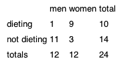

Frequency tests
================

* Example: Prop of dieting woman higher than for men?



```
?fisher.test
```


Proportion Tests
================

```{r}
prop.test(x=333, n=1022, conf.level=0.98)

prop.test(x=333, n=1022)
```

From
http://stats.stackexchange.com/questions/60073/confidence-interval-for-difference-between-proportions

The sample size is 34, of which 19 are females and 15 are males. Therefore, the difference in proportions is 0.1176471.

```{r}
19/34 - 15/34
prop.test(x=c(19,15), n=c(34,34), correct=FALSE)

## also works for single proportion
#prop.test(x=c(19), n=c(34), correct=FALSE)
#prop.test(x=c(19,15,20), n=c(34,34,34), correct=FALSE)
```
Also see <http://stat.ethz.ch/R-manual/R-devel/library/stats/html/prop.test.html>

Nice math introhttps://onlinecourses.science.psu.edu/statprogram/node/164 with t-statistc


Confidence around proportions
-----------------------------

Formula:
 > If the samples size n and population proportion p satisfy the condition that np ≥ 5 and n(1 − p) ≥ 5, than the end points of the interval estimate at (1 − α) confidence level is defined in terms of the sample proportion as follows.
 

CI math is detailed out under http://www.statisticslectures.com/topics/ciproportions/

```{r}
prop.test(x=333, n=1022, conf.level=0.98)
plot(1:10)
plot(1:10)
prop.test(x=333, n=1022)
plot(1:10)
```

